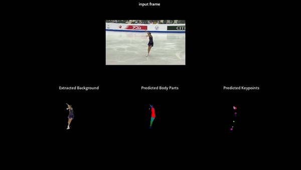

# Action Recognition in Figure Ice Skating

> Next level figure skating ai analysis.

<p style="text-align:center; background-color: gray;"></p>

[Human Pose Recognition in Figure Ice Skating](#action-recognition-in-figure-ice-skating)

# TOC

- [Installation](#installation)
- [Start training process](#start-training-process)
- [Test skatingAI - extract background, predict body parts or keypoints](#test-skatingAI---extract-background,-predict-body-parts-or-keypoints)

---

This research investigates state-of-the art systems such as 
[OpenPose](https://github.com/CMU-Perceptual-Computing-Lab/openpose)
, [VideoPose3d](https://github.com/facebookresearch/VideoPose3D) or [wrnch.ai](https://wrnch.ai/) on 
their performance on figure ice skating. 
All tested systems had problems with spins in figure ice skating. Especially the ones with 
elastic poses such as the Biellmann pirouette.

This is why this investigative project was called into life to understand, how pose recognition works in depth 
and understand how performance of keypoint recognition in figure ice skating can be improved.  
With the here presented project further research work shall be brought forward in the figure ice skating pose recognition or
general human pose estimation field of artistic sports, with a well structured, easy to understand and follow up code project 
with Tensorflow 2.

Altogether, three sub-projects were created:

1) 🎓  exercises: 
    - understand image segmentation with the Tensorflow tutorial: [Image segmentation](https://www.tensorflow.org/tutorials/images/segmentation) 
    tutorial from Tensorflow to understand key aspects of neural network creation with Tensorflow 2
2) 🖥️  skatingAI
    - the main Python module for this research
3) 🖋️  thesis
    - includes master thesis and excerpt regarding this investigative research
    
    

# 🖥️  skatingAI

<p style="text-align:center; background-color: gray;"></p>

## Installation
This project was built upon [Tensorflow 2](https://www.tensorflow.org/) with Python 3.6. 
The easiest way to get started is to run everything inside a [Docker](https://docs.docker.com/) container.

1) Create `skating-ai` docker image from our Dockerfile
    ```bash
    docker build -t skating-ai skatingAI/Docker/
    ```
2) Run `skating-ai` docker container from the above created container, bind local file system into docker container 
and log into container *(you can choose a different container name, and restrict gpu usage for your likings)*
    ```bash
    docker run -it\
        --name skating-ai\
        --gpus all\
        --mount type=bind,source="$(pwd)"/skatingAI,target=/skatingAI\
        skating-ai:latest
    ```
> Prerequisite: you need an [nvidia-docker](https://github.com/NVIDIA/nvidia-docker) installation
>
3) Download video data and preprocess data from [3DPEOPLE DATASET](https://cv.iri.upc-csic.es/)
    ```bash
   cd skatingAI/Data/3dhuman
   python data_admin.py
   ```
   This download of data takes a couple of hours.


## Start training process
Three modules were created for background extraction, body part prediction and keypoint detection.
These complete training modules can be found in `skatingAI/modules`.

For the ablation study several network architectures for the different networks were created in 
`skatingAI/nets`.

Start the training process inside the docker container:
```bash
python train.py
```
After starting the training process a menu will appear in which you can choose the paramaters for the network.
You can either choose the default ones, or define your custom parameters for gpu, batch_size etc.

The second menu which appears allows you to choose between which module you want to train background extraction, 
human part detection or keypoint detection.

The menu which appears after that allows you to choose a certain training setting, which we experimented with in our 
ablation study. Variations are between, network architecture, loss function and optimizer.
In `skatingAI/utils/hyper_paramater.py` you can define your own custom setting.

### Logging - images, weights, Tensorboard
If sticked to the default parameters, every 5 epochs the predicted images and weights will be logged to your local 
file system. So you can follow the training process.

Furthermore, several variables will be logged additionally to `skatingAI/logs` such as the accuracy or loss curves, 
histograms and distributions on how the network parameters progressed during training.
Additionally, we log some descriptive information about the training setting in the text information of the Tensorboard.


## Test skatingAI - extract background, predict body parts or keypoints
To test skatingAI on some random videos from the [3DPEOPLE DATASET](https://cv.iri.upc-csic.es/) run:
```bash
python predict.py
```
Or with the `--video` parameter you can specify the path to a custom video file:

```bash
python predict.py --video /path/to/file/video.avi
```

## Evaluate different networks
To get more insights on what the indiviudal convolutional layers have learned the *Evaluator* creates visualization of 
the learned filters.

```bash
python evaluate/eval.py 
```
The resulting images can be found in *evaluate/img*


## Further information
If you find any bug 🐞, please feel free to create a pull request with a fix ✔️, or create an issue.


This project accompanying the master thesis of Nadin-Katrin Apel at the Stuttgart Media University and 
supervised by the Professors Johannes Maucher and Stefan Radicke.

With this project the author strives to further strive research towards pose recognition or action recognition 
towards artistic sports such as figure ice skating.

And in general to provide other developers an easy understandable code base to play around with convolutional 
networks and pose recognition architectures.

This project stands under the MIT license.