# Change Log

> In this work, an approach to detect human body joints with only little computation complexity will be researched with a special focus on figure ice skating. The resulting application should be able to run on mobile phones and detect body joints from just the camera image. 
>
> Therefore, the different implementations from OpenPose in C++, TensorFlow and PyTorch will be explored and inspected. These already include some experiments with different neuronal network architectures, however their keypoint detection amount varies as does their current work status or rather commit frequency. Furthermore, a new paper suggests ‘spatio temporal affinity fields’, which will be analyzed in this project.
>
> Different experiments and evaluations of the already existing research projects on keypoint detection will add to the final application. The training will be conducted on the provided DeepLearn server from the Stuttgart Media University. Therefore, the data from PoseTrack and the Coco dataset will be used.
>
> Since this research focuses on the detection of keypoints in figure ice skating, further considerations must be taken in mind: people in the background should not be detected, but only the person in focus for later analysis. The question there is, how to get the corespondent training data.

---


## 2018-04-01 [Status Report]: Improve Custom Training Loop, Evaluation, Loss Function
#### Learned Mask:
   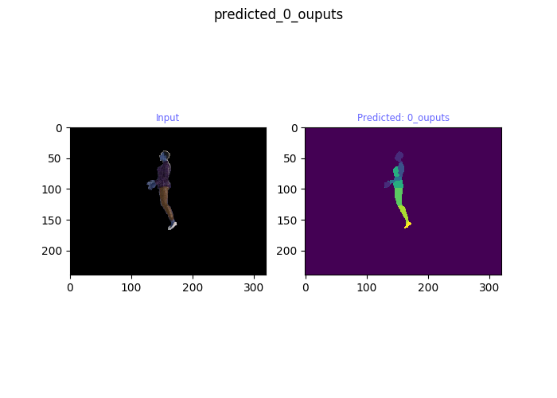  
#### Learned Classes
   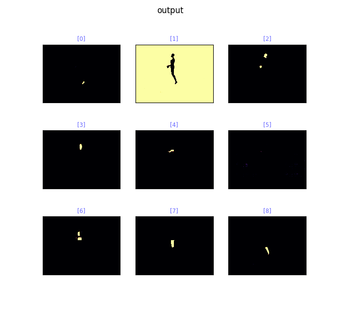  
- experiment with different net structures
    - try to train faster/ less memory
        - strided-down/-up convolution architecture: result converges worse
        - rescale in dataset generator: works far better (graphs will be included later)
    - u-net with mobilenetv2 as base (not able to learn body parts)
    - u-net as base for HPNet (converges worse than just HPNet and is slower)
    - improve HPNet with filter amount and layer amount according to evaluation analysis of layers
        - combine add and concat of layers
        - always add the initial Input layer to concat/ add
        - performs best
    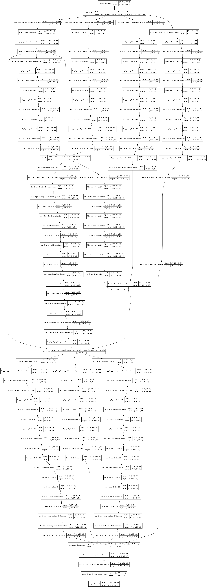  
- create new custom loss function for Class Imbalance
    - create weighed map according to a calculated graph with the relative body part distances
- reduce classes to 9
- add automatic dataset download and processing including saving in numpy compressed files

- 
-   
- 

    
   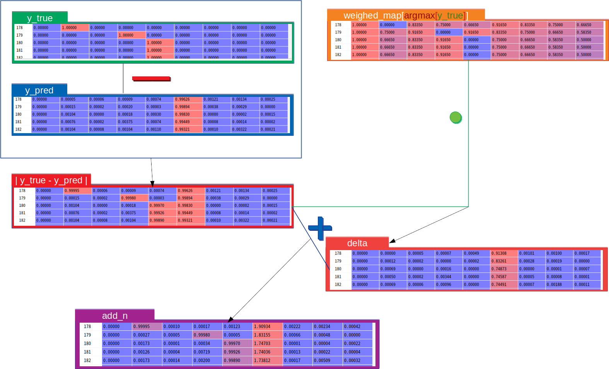  
    - the new loss increased training efficiency a lot (exact results will be included later)
    
 - improve evaluation
    - add functionality to test different net architectures 
    - add simple save functionality
    - show predicted images additionally to feature maps of layers
    - code refactoring & improvement
    - evaluation of best performing net HPNet with Adam optimizer after epoch 1595 [v7_1595_adam_1595_mask](skatingAI/evaluate/img/v7_1595_adam_1595_mask)
- evaluate different optimizers, learning rates & learning rate adjustments
#### Accuracy of different used optimizers
> red: adam; learning rate: 0.01  
> orange: nadam; learning rate: 0.01  
>blue: sgd  learning rate: 0.1  
>green: sgd with custom decay (increase on plateau; decrease with variable decay)  
>light blue: sgd with custom decay of 0.001  
>
**Accuracy:**
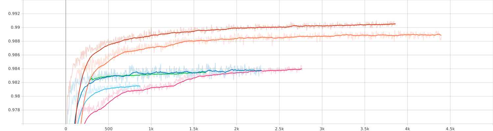
**Relation of correct body part pixel to all body part pixel**
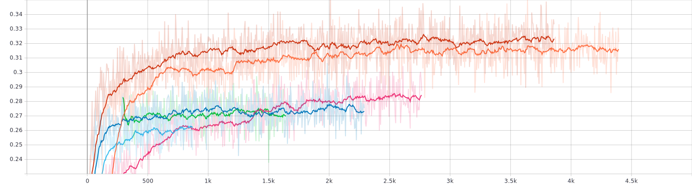
**Comparison of loss**
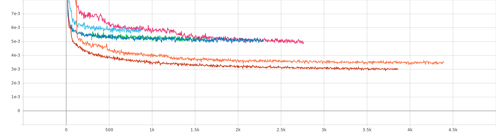
**Learning Rates of SGD and SGD with custom loss**
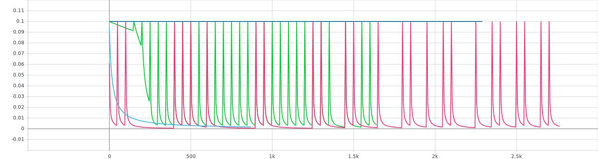
**Comparison of SGD and custom decay/ learning rates**
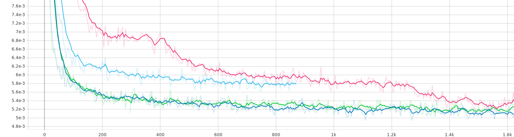


## 2020-03-01 [Status Report]: Create Custom Training Loop (first step)

- Solve problems with Tensorflow 2:
    - tries to use available GPUs out-of-the box if configured correctly otherwise falls back to CPU
    - [official docker container](https://www.tensorflow.org/install/docker) from documentation uses Python 2 
    - try out multiple containers and find [tensorflow/tensorflow:latest-devel-gpu-py3](https://hub.docker.com/r/tensorflow/tensorflow/tags)
     to work with GPUs and Python 3 as expected
- create Python Generator function for loading the image data and not running out of memory
- cleanup code to use classes and type information
- create custom training loop
- integrate tensorboard logging information
- create HRNetwork with 3 building blocks for the body segmentation task: [Model Architecture](#custom-hrnet-model)

### Analysis initial test training

The [Prediction](#predition-after-last-epoch) after the 64th epoch shows compared to 
the [prediction](#predition-after-2nd-epoch), that the network learns to categorize the pixel data better to the different
classes after some epochs. At the beginning the prediction shows a variegated picture with multiple class predictions, 
with preceding epochs this prediction becomes clearer and less scattered.

However, the prediction at the end seems to target the torso as main class, 
probably because it's pixels appears most often in the picture. 
Therefore, the hyperparameters and loss functions must be further refined for getting decent training results.

This behavior is reflected by the loss and accuracy graphs.
The [accuracy graph](#accuracy-plot) starts to flatten after the 35th episode and reassembles 
a logarithmic graph which converges to 0.94. It rises rather quickly however, the result is not the desired body segmentation.
Here accuracy is probably the wrong metric. *(Experiments will follow)*

The [loss graph](#loss-plot) starts to flatten already after the 30th episode and does not improve much until the last 
episode. The difference is only about 0.03.
Here as well experiments with the hyperparameters and loss function must be conducted.

**Training configuration:**
```
batch_size = 3
prefetch_batch_buffer = 1
epoch_steps = 32
epoch_log_n = epoch_steps // 2
epochs = 64

optimizer = tf.keras.optimizers.SGD(learning_rate=1e-3)
loss_fn = tf.keras.losses.SparseCategoricalCrossentropy(from_logits=True)
```

#### Loss Plot
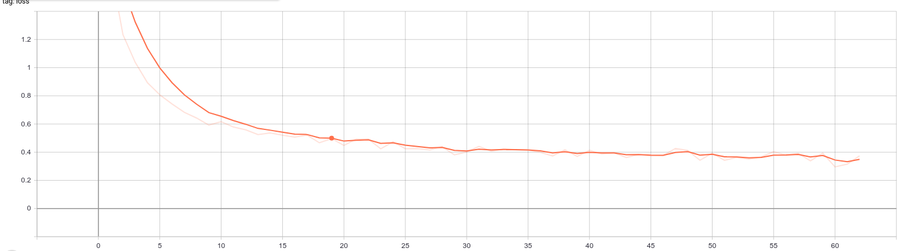  
#### Accuracy Plot
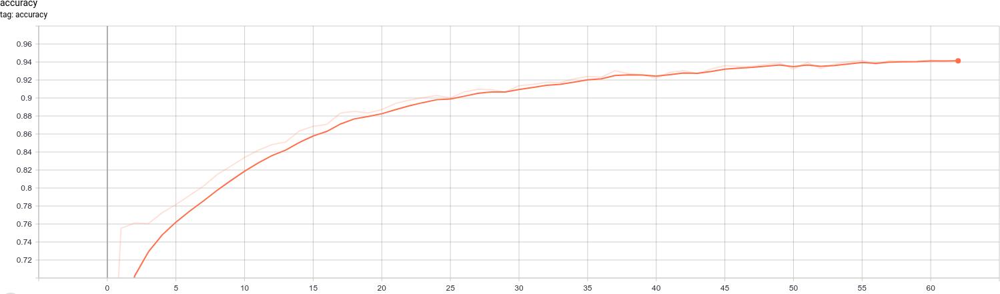  
#### Predition after 2nd epoch
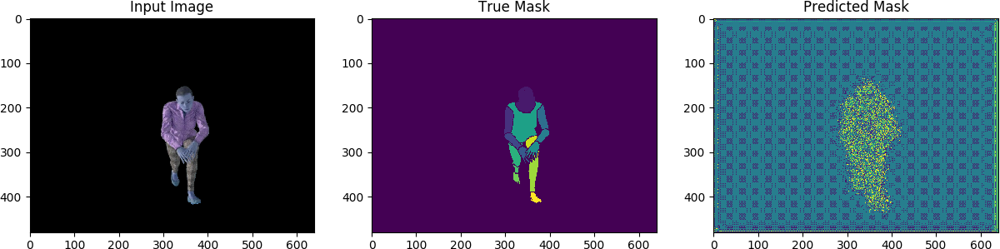  
#### Predition after last epoch
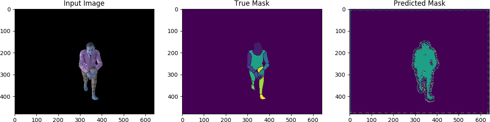  
### Custom HPNet Model
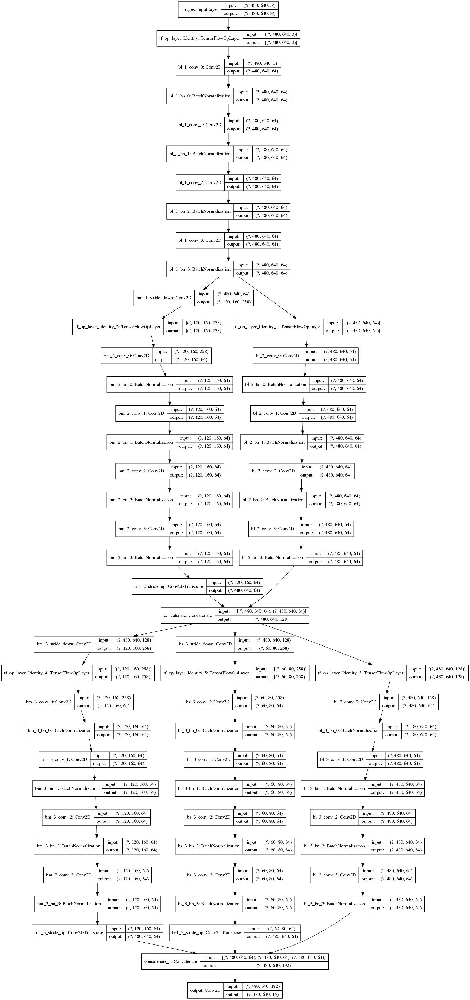
------

## 2020-02-14 [Status Report]: Preprocess 3DHuman Dataset

- request access to dataset
- for initial testing purposes: 
    - download first woman batch *(including different female characters and 70 actions)*
        - segmentation_body: as label for the body segmentation task
        - segmentation_clothes : label for avatar clothes
        - rgb : as input image data 
- preprocessing:
    - cleanup segmentation body include clear labels 
        - convert rgb to classes [0;14] 
        - remove in-between pixels
        - ref. [table: body segmentation class labels](#body-segmentation-class-labels)
    - store frames beloning to one action in one compressed numpy **.npz** file to save memory and speedup trainig
    - remove background from rgb data by using segmentation_clothes *(idea: level 1 training)*

### Body segmentation class labels 

| class | name     | pixel color     |
| ----- | -------- | --------------- |
| 0     | bg       | [153,153,153]   |
| 1     | Head     | [128,64,0]      |
| 2     | RUpArm   | [128, 0, 128]   |
| 3     | RForeArm | [128, 128, 255] |
| 4     | RHand    | [255, 128, 128] |
| 5     | LUpArm   | [0, 0, 255]     |
| 6     | LForeArm | [128, 128, 0]   |
| 7     | LHand    | [0, 128, 0]     |
| 8     | torso    | [128, 0, 0]     |
| 9     | RThigh   | [128, 255, 128] |
| 10    | RLowLeg  | [255, 255, 128] |
| 11    | RFoot    | [255, 0, 255]   |
| 12    | LThigh   | [0, 128, 128]   |
| 13    | LLowLeg  | [0, 0, 128]     |
| 14    | LFoot    | [255, 128, 0]   |


---

## 2020-02-07 [Status Report]: Refine Ressearch

- discuss paper with Johannes Theodoridis
- Result: 
    - combine [HPNet](https://arxiv.org/pdf/1908.07919) pose recognition instead of PAF from 
    [STAF](https://arxiv.org/pdf/1811.11975) with Keypoint Recognition
    - implement step-wise

---

## 2020-02-07 [Status Report]: XSens Motion Capture Record

- plan new Motion Record in ice rink
- Problems:
    - skater injured
    - substitute skater is in competition preparation and has not enough time for decent recording
- Result: 
    - Recording must be repeated
    - new scheduled recording on march 6th
- find substitute dataset to work with:
    - [3DPEOPLE DATASET](https://cv.iri.upc-csic.es/)
    - similar approach with blender and Motion capturing
    - will be used for creating the initial training


---

## 2020-01-12 [Status Report]: XSens Motion Capture Dataset

- record mocap data with XSens in the ice rink
- research and experiment wit XSens data
  - create avatar and integrate Makehuman plugin into blender
  - create simple 3d test-scene and experiment with mocap data settings
  - write script to get 2d locations of keypoints equal to the Openpose dataset
  - analyze keypoints in rendered video

---

## 2019-12-03 [Status Report]: Analyze Figure Ice Skating Dataset

- find figure ice skating videos for labeling:
  - 332 MB of Video Data
  - filmed from different mobile devices and a GOPRO 5 Hero Black
  - videos of different length, perspectives, moving camera, different ice rinks and lightning conditions
- set-up Docker container on hal9k MI server: create Docker image
- create bash script to traverse all video files and label by OpenPose
- inspect labeled video quality
  - write script to detect on how many frames no person was detected and analyze these frames
    - create video data without these frames
      - analysis: on some videos on every frame a person was detected. No pattern for device type identifiable
      - videos still play fluently
    - detect the person in focus by taking the person with the highest score
  - check quality of videos by iterating over all videos, find subsequent frames with a minimum score
    - &rarr; This tests two conditions
      - whether from the subsequent frames, the keypoints with the maximum scores applied to these frames, would enhance the labels
      - if there can't be found subsequent frames with the specified score, the videos are marked as 'not usable labels'
    - manually analyze the images of the found subsequent frames
      - **Result**: sometimes very bad labeled frames, however they receive a relatively high score

---

## 2019-11-22 [Status Report]: Get Ready For Machine Learning

- Work over the book: [Deep Learning for Computer Vision By Rajalingappa Shanmugamani](https://learning.oreilly.com/library/view/deep-learning-for/9781788295628/)
  - book repeats several basics in a rough overview
  - many practical examples from different ML problems
- Practical pre-experiments
  - implement simple UNet with a pre-trained VGG-16 encoder
  - include tensorboard statistics for later evaluations

---

## 2019-11-17 [Status Report]: Planning
- create [initial project plan](https://docs.google.com/spreadsheets/d/1UiY_DN8u3v3q78M2Kt0J7INSgaR_6g2AVlFXYTfgT5g/edit#gid=0)
- write [project proposal](https://docs.google.com/document/d/1Yug-XjIxy3NjOoxbsPSLWGuDJFEE9NyPOWErCEk7S0I/edit)
- Difficulties in planning:
  - problems to setup OpenPose (mainly CMAKE)
    - only works with a reduced network on a usual laptop
    - not mobile ready
- Change focus of investigation *(included in project plan)*
  - investigations of the tensorflow and Pytorch github repositories
  resulted in the conclusion, to put the main focus on
  keypoint recognition with focus on performance,
  than the analysis of the curves
  - the Tensorflow and Pytorch repositories rely on the old *[initial](https://arxiv.org/pdf/1611.08050.pdf)* architecture of PAF *(no active commits to the repositories)*
    - make the training run, needed some tweaking in the code
    - the tensorflow implementation experiments with different pre-trained nets *(e.g. mobile-net versions)*
      - labeling works well on a usual laptop
  
---

## 2019-11-06 [Kickoff-Meeting]: Initial Research

- compare multiple paper - two main paper: 
  - [OpenPose: Whole-Body Pose Estimation](https://www.ri.cmu.edu/wp-content/uploads/2019/05/MS_Thesis___Gines_Hidalgo___latest_compressed.pdf)
    - network is trained in a single stage using multi-task learning
    - find keypoints with the help of Part Affinity Fields and Confidence Maps
  - [Efficient Online Multi-Person 2D Pose Tracking with
Recurrent Spatio-Temporal Affinity Fields](https://arxiv.org/pdf/1811.11975.pdf)
    - additionally to OpenPose, the temporal component is regarded

---
---
